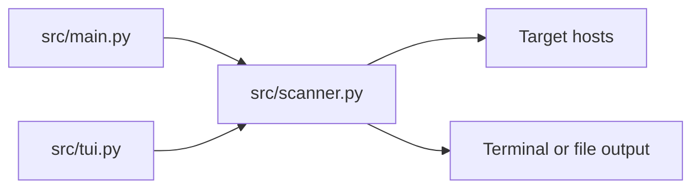

<div align="center">

<table>
    <tr>
        <td>
<pre>
+-------------------------------------------------------------------+
|                       NETWORK SCANNING TOOL                       |
|       Fast, pragmatic recon for hosts, ports, and services.       |
+-------------------------------------------------------------------+
</pre>
        </td>
    </tr>
</table>

</div>

<!-- readme-gen:start:badges -->
<div align="center">


</div>
<!-- readme-gen:end:badges -->

<!-- readme-gen:start:tech-stack -->
<p align="center">
    
</p>
<!-- readme-gen:end:tech-stack -->

> Network reconnaissance should be fast, readable, and safe by default. This tool gives you a single CLI and TUI surface to check host liveness, probe ports, and collect basic service hints without drowning you in noise.

---

## Highlights

- ICMP, TCP SYN, UDP, and ARP scanning with a single command surface
- Unprivileged fallback path (ICMP via ping, TCP connect, UDP best effort)
- Basic service detection for TCP banners and UDP response hints
- Curses-based TUI for interactive runs
- Output files with run metadata headers and safe overwrite controls
- Tunable timeout, delay, and UDP ambiguity policy

## Quick Start

### Requirements

- Python 3.10+
- Admin/root permissions for raw packet scans (ARP and full "all" mode)
- Network authorization to scan your targets

### Install

```
git clone https://github.com/Ayushman-Singh08/-Network-Scanning-Tool.git
cd -Network-Scanning-Tool
python -m venv .venv
```

Windows:

```
.\.venv\Scripts\Activate.ps1
pip install -r requirements.txt
```

Linux/macOS:

```
source .venv/bin/activate
pip install -r requirements.txt
```

### Run

```
python src/main.py 192.168.1.1 -t icmp
python src/main.py 192.168.1.1 -t tcp -p 22,80,443
python src/main.py 192.168.1.1 -t udp -p 53,123,161 --udp-ambiguity open
python src/main.py 192.168.1.0/24 -t arp
```

### TUI Mode

```
python src/main.py --tui
```

### Unprivileged Mode

```
python src/main.py 192.168.1.1 -t tcp -p 80,443 --unprivileged
```

When run without admin/root privileges, the tool automatically falls back to unprivileged mode and warns about ARP limitations.

## Output

- Terminal output is printed via a consistent summary format.
- Use `-o <file>` to write to a text file with metadata headers.
- `--append` adds to existing files, and `--force` overwrites safely.

## Documentation

- [docs/Documentation_Overview.md](docs/Documentation_Overview.md)
- [docs/UDP_FEATURE_GUIDE.md](docs/UDP_FEATURE_GUIDE.md)
- [docs/guides/troubleshooting.md](docs/guides/troubleshooting.md)
- [docs/api/README.md](docs/api/README.md)

---

## Architecture

<!-- readme-gen:start:architecture -->

<!-- readme-gen:end:architecture -->

## Project Structure

<!-- readme-gen:start:tree -->
```
Network-Scanning-Tool/
├── .github/
│   └── workflows/
│       └── ci.yml
├── docs/
│   ├── Documentation_Overview.md
│   ├── UDP_FEATURE_GUIDE.md
│   └── guides/
├── scripts/
│   ├── bootstrap.ps1
│   └── bootstrap.sh
├── src/
│   ├── main.py
│   ├── scanner.py
│   └── tui.py
├── tests/
│   ├── test_integration.py
│   ├── test_main.py
│   ├── test_scanner.py
│   └── test_tui.py
├── .coveragerc
├── .readme-gen.json
├── CONTRIBUTING.md
├── LICENSE
├── mypy.ini
├── pytest.ini
├── requirements.txt
├── requirements-dev.txt
└── setup.py
```
<!-- readme-gen:end:tree -->

## Project Health

<!-- readme-gen:start:health -->
| Category | Status | Score |
|:---------|:------:|------:|
| Tests | ################.... | 80% |
| CI/CD | ################.... | 80% |
| Type Safety | ################.... | 80% |
| Documentation | ################.... | 80% |
| Coverage | ##################.. | 90% |

> Overall: 82% - Healthy
<!-- readme-gen:end:health -->

## Contributing

Contributions are welcome. Please see [CONTRIBUTING.md](CONTRIBUTING.md) for setup, test guidance, and PR expectations.

## License

MIT. See [LICENSE](LICENSE).

<!-- readme-gen:start:footer -->
<div align="center">


Built with care by [Contributors](https://github.com/Ayushman-Singh08/-Network-Scanning-Tool/graphs/contributors)
</div>
<!-- readme-gen:end:footer -->
